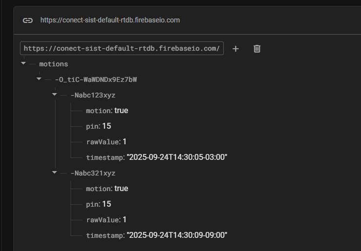

# ESP32 + PIR (SR501) + Firebase Realtime Database

Este projeto utiliza um **ESP32** e um sensor de movimento **PIR SR501** para detectar presença e enviar os eventos para o **Firebase Realtime Database**, incluindo data e hora formatadas em ISO8601.

<br>

A estrutura JSON utilizada no Firebase Realtime Database será a seguinte:



## 🔧 Hardware
- ESP32 DevKit
- Sensor PIR HC-SR501
- Jumpers

### Ligações
- SR501 VCC → 3.3V do ESP32  
- SR501 GND → GND do ESP32  
- SR501 OUT → GPIO 15 (pode ser alterado no código)  

## 📦 Dependências
- [Firebase ESP32 (Mobizt)](https://github.com/mobizt/Firebase-ESP32)  
- `WiFi.h` (incluso no core ESP32)  
- `time.h` (incluso no core ESP32)  

## ⚙️ Configuração
1. Configure o **Firebase Realtime Database** e copie a URL do projeto.  
2. No console do Firebase, defina regras de teste (⚠️ apenas para desenvolvimento):  
   ```json
   {
     "rules": {
       ".read": true,
       ".write": true
     }
   }
